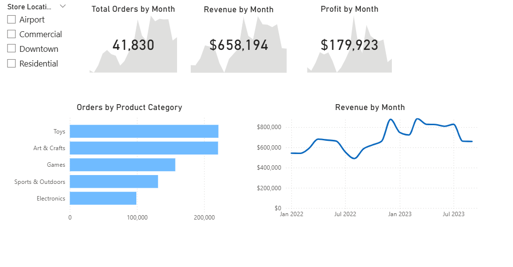

# Toys Sales Dashboard by Power BI

A Power BI report built on the **Maven Toys** dataset to analyze sales performance and track key KPIs (Orders, Revenue, Profit) across time, product categories, and store locations.

---

## Dataset, Data Validation & Data Modeling
- Built from four CSV tables: **sales** (fact), **products**, **stores**, **calendar** (dimensions)
- Reviewed columns, checked **blank/null values**, confirmed **data types**, and identified **primary/foreign keys**
- Performed quick exploration: **transaction count**, **store count**, and **min/max product price**
- Created a **star schema** with **1:many** relationships from **sales → products/stores/calendar**
- Hid foreign keys in `sales` from report view for a cleaner field list
- Enhanced `calendar` with **Start of Month** and **Start of Week**, and created a **date hierarchy** (Start of Month → Start of Week → Date)

## Calculations
- Created calculated columns to bring **Cost** and **Price** into `sales`, then calculated **Revenue** and **Profit** per transaction
- Built measures: **Total Orders**, **Total Revenue**, **Total Profit**
- Bonus: Defined Revenue/Profit measures without referencing calculated columns

## Report Visuals
- KPI cards for current month (**Orders, Revenue, Profit**) with monthly trends
- Store location slicer
- Bar chart: **Total Orders by Product Category**
- Line chart: **Total Revenue over time** using the date hierarchy
- Final layout polished for readability and alignment

## 🔎 Key Findings
- **41,830** orders (current month)
- **$658,194** revenue; **$179,923** profit (~**27%** margin)
- Revenue trend: **growth → peaks (~$800K) → recent dip**
- Top order categories: **Toys**, **Art & Crafts**, **Games**
- Lowest order category: **Electronics** (improvement opportunity)

## Author
**Sophie Ranj** — ranj.sophie@outlook.com  
LinkedIn: <a href="https://linkedin.com/in/sophie-ranj" target="_blank" rel="noopener noreferrer">linkedin.com/in/sophie-ranj</a>  
Portfolio: <a href="https://sophie-ranj.github.io/" target="_blank" rel="noopener noreferrer">sophie-ranj.github.io</a>
